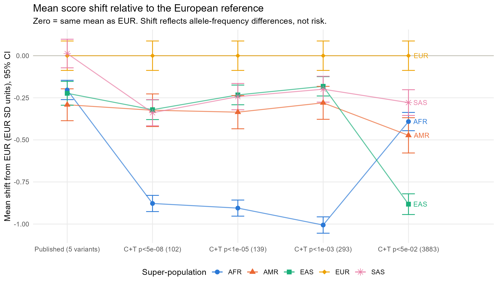

# amd-prs-r

Ancestry portability of a polygenic risk score (PRS) for age-related macular
degeneration (AMD), built in R from public data. A self-directed genetic
epidemiology learning project.

## Aim

**Primary.** Build a PRS for advanced AMD from the IAMDGC 2016 GWAS summary
statistics (European-ancestry discovery) and apply it to the 1000 Genomes
Phase 3 reference panel, to assess how the score's distribution, effect-allele
frequencies and variant coverage change across the five super-populations
(AFR, AMR, EAS, EUR, SAS). Because 1000 Genomes has no AMD phenotype, this is
an assessment of *distribution shift*, not predictive accuracy.

**Secondary.**

- Genotype quality control with PLINK 2.
- Principal component analysis for genetic ancestry with bigsnpr.
- A clearly labelled **simulated** gene-environment interaction illustration.

## Scope and limitations

The score is **partial**: only chromosomes 1 and 10 are used, chosen because
they carry the *CFH* and *ARMS2/HTRA1* regions, which together account for
roughly half of the known AMD genetic signal. It is therefore not comparable
to published genome-wide AMD scores, and absolute risk cannot be derived from
it. The 1000 Genomes panel has **no phenotypes**, so no association between
the score and AMD, and no gene-environment effect, is tested on real data;
the ancestry comparison describes how the score's distribution and variant
coverage shift between populations, and the gene-environment section is an
explicitly labelled simulation.

## Data sources

| Data | Source | Terms |
|---|---|---|
| 1000 Genomes Phase 3, chr1 + chr10 VCF and sample panel (GRCh37) | EBI FTP, release 20130502 | Open, no registration |
| IAMDGC 2016 advanced AMD summary statistics (Fritsche et al., *Nat Genet* 2016) | GWAS Catalog accession GCST003219, GRCh37 formatted file | EMBL-EBI Terms of Use, no registration; attribution expected |

Full details, checksums, citations and the automatically generated download
log are in [docs/data_sources.md](docs/data_sources.md). No data are committed
to this repository.

## How to reproduce

Prerequisites: R >= 4.3, the Quarto CLI, git, and the PLINK 1.9 and PLINK 2
binaries placed in `bin/` (see [bin/README.md](bin/README.md)). Run everything
from the repository root.

```sh
# 1. Restore the exact package versions recorded in renv.lock
Rscript -e "renv::restore()"

# 2. Run the pipeline in order (downloads ~2.1 GB on first run)
for f in R/0*.R; do Rscript "$f" || break; done     # bash
# Get-ChildItem R\0*.R | ForEach-Object { Rscript $_.FullName }   # PowerShell

# 3. Render the report to _site/report/report.html
quarto render
```

## Repository layout

```
amd-prs-r/
  R/               01_download.R  02_qc.R  03_pca.R  04_prs.R
                   05_portability.R  06_gxe_simulation.R
  report/          report.qmd and figures/ (rendered HTML goes to _site/, gitignored)
  docs/            data_sources.md, decisions.md
  data/raw/        downloaded inputs            (gitignored)
  data/processed/  outputs of the scripts       (gitignored)
  bin/             PLINK binaries               (gitignored)
  DESCRIPTION      package manifest that renv snapshots
  renv.lock        pinned package versions
  _quarto.yml      Quarto project (execute-dir: project)
  .Rprofile        activates renv and anchors here::here()
```

Every script runs non-interactively with `Rscript` from the repository root,
reads from `data/raw/`, writes to `data/processed/`, and starts with a header
comment stating its purpose, inputs and outputs.

## Analysis decisions

Every analytical choice, its rationale, and who made it is logged in
[docs/decisions.md](docs/decisions.md), together with the auto-generated
outcome tables each script writes (QC counts, PCA, PRS construction,
portability).

## Key results

Full results, tables and figures are in the rendered report, published at
<https://odogwu90.github.io/amd-prs-r/report/report.html> (`quarto render`
rebuilds it locally into `_site/`); the numbers below are from
`docs/decisions.md`.

- **QC.** 10,460,313 chr1 + chr10 records became 1,552,816 biallelic SNPs with
  MAF >= 0.01; 20 of 2,504 samples were removed as second-degree relatives.
- **Ancestry.** 10 PCs from 92,108 LD-pruned variants; PC1 (7.6 %) separates
  AFR, PC2 (2.7 %) separates EAS from EUR.
- **Scores.** The public IAMDGC file has no effect sizes, so the
  clumping-and-thresholding weights are approximate log-odds derived from the
  signed z-scores and EUR allele frequencies (validated against the five
  reported odds ratios, ratio 0.83 to 1.09). The published-variant score uses
  the five of ten curated chr1/chr10 variants that survive QC.
- **Portability (primary aim).** Every non-European group scores below EUR on
  average, and the gap widens with more variants: with the 102-variant score
  at p < 5e-8 the AFR mean sits 0.88 EUR SD below EUR and its spread is 0.63
  of the EUR spread, while the five-variant score shifts by 0.2 to 0.3 SD.
  The shift decomposes exactly into effect-allele frequency differences,
  dominated by CFH/CFHR-region alleles.
- **Simulation.** A labelled simulation recovers the generating odds ratios
  and shows that a 1.3 interaction is only borderline detectable at n = 2,484.



## Status

Complete: all six scripts run end to end and the report renders.

## Licence

Code is released under the MIT licence (see [LICENSE](LICENSE)). Data remain
under their original terms.
