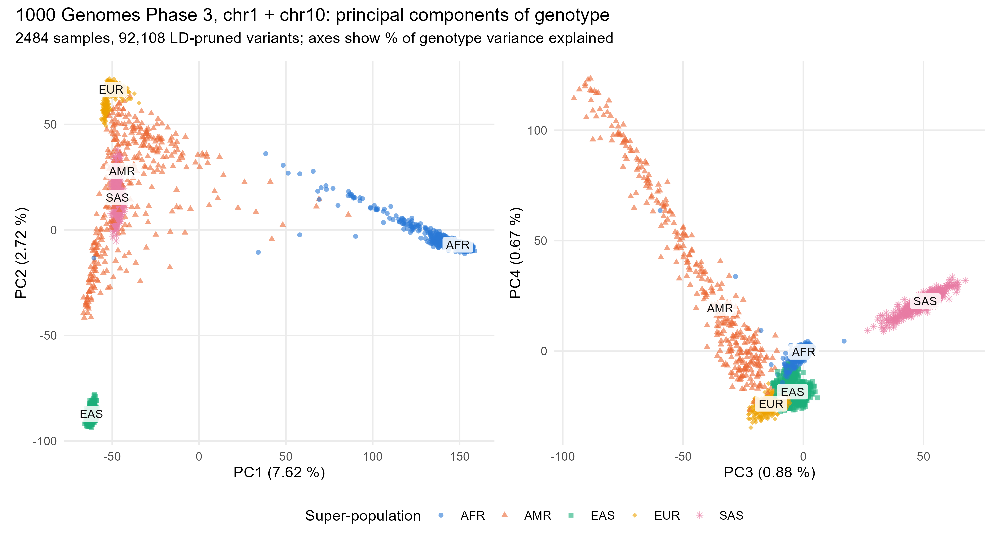
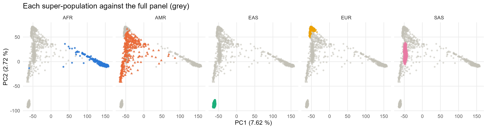
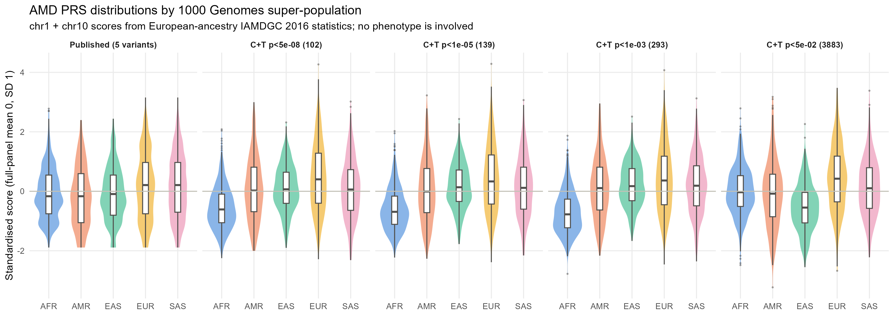
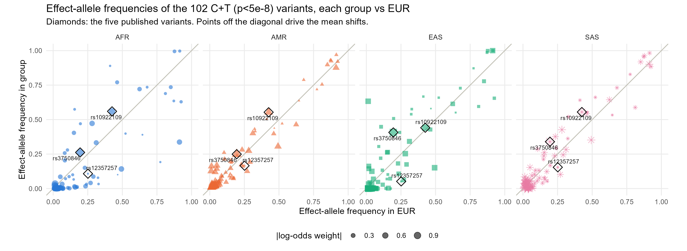
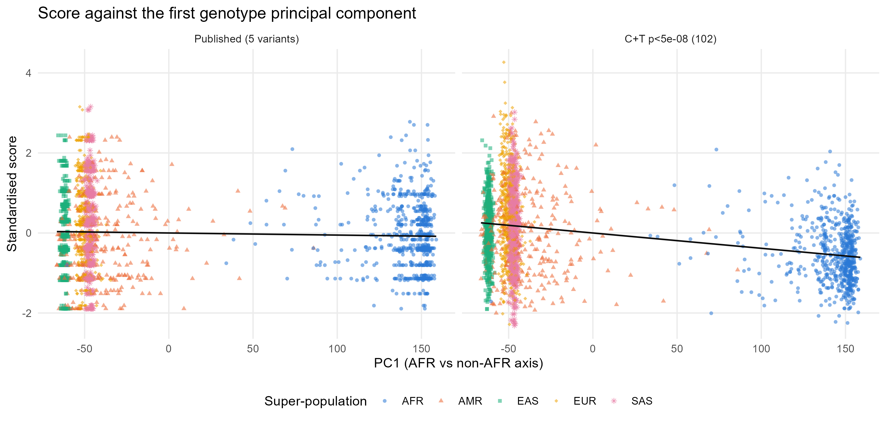
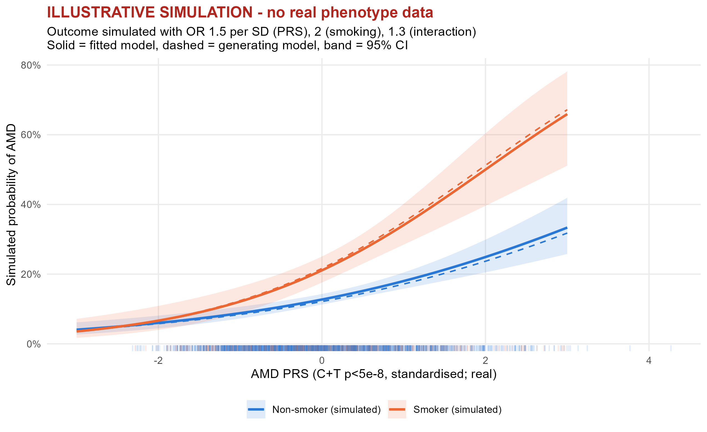

```{r}
#| label: setup
library(here)
library(tidyverse)
library(knitr)

proc <- function(...) here("data", "processed", ...)
fig  <- function(f) here("report", "figures", f)
tsv  <- function(f) read_tsv(proc(f), show_col_types = FALSE)
csv  <- function(f) read_csv(proc(f), show_col_types = FALSE)
fmt  <- function(x) format(x, big.mark = ",")
```

::: {.callout-important title="Scope and limitations, read first"}
- The score is **partial**: chromosomes 1 and 10 only, chosen because they carry *CFH* and *ARMS2/HTRA1*, the two largest AMD loci, together roughly half of the known genetic signal. It is not comparable with published genome-wide AMD scores and cannot give absolute risk.
- The 1000 Genomes panel has **no phenotypes**. "Portability" here means how the score's distribution and variant coverage shift between populations. No association with AMD is tested on real data.
- The public IAMDGC 2016 release contains **no effect sizes**, only p-values and direction signs. Section 5 explains how weights were recovered and how well that worked.
- Section 7 is an **explicitly simulated** illustration; both its exposure and its outcome are random numbers.
:::

## 1. Aim

**Primary.** Build a PRS for advanced AMD from the IAMDGC 2016 GWAS (European-ancestry discovery) and describe how it behaves across the five 1000 Genomes super-populations, AFR, AMR, EAS, EUR and SAS, with EUR as the reference.

**Secondary.** Genotype QC with PLINK 2, principal component analysis with bigsnpr, and a labelled simulation showing how a gene-environment interaction analysis would be set up.

All analytical decisions, who made them and why, are logged in `docs/decisions.md` (D-01 to D-18). The numbers in this report are read from the files each script writes, so re-running the pipeline updates the report.

## 2. Data

| Data | Source | Build | Terms |
|---|---|---|---|
| 1000 Genomes Phase 3, chr1 + chr10 genotypes and sample panel | EBI FTP, release 2013-05-02, call set v5b | GRCh37 | Open |
| IAMDGC 2016 advanced AMD GWAS (Fritsche *et al.*, *Nat Genet* 48:134, 2016; 16,144 cases, 17,832 controls, European ancestry) | GWAS Catalog GCST003219: author's summary file and the Catalog's curated list of 52 reported variants with odds ratios | GRCh37 | EMBL-EBI Terms of Use |

```{r}
#| label: tbl-downloads
#| tbl-cap: "Files downloaded by 01_download.R, with checksum status."
read_tsv(here("data", "raw", "checksums.tsv"), show_col_types = FALSE) |>
  transmute(Dataset = dataset, File = file, `Size (MB)` = round(size_bytes / 1e6, 1),
            `md5 source` = md5_source, Status = status) |>
  kable()
```

## 3. Quality control

Filters follow D-08 and D-09: biallelic A/C/G/T SNPs; unique `chr:pos:ref:alt` identifiers; MAF ≥ 0.01 in the pooled sample; per-variant missingness < 0.02; no Hardy-Weinberg filter on the pooled, mixed-ancestry sample; relatedness removed with KING kinship > 0.0884 (second degree). Strand-ambiguous SNPs are removed later, at the summary-statistics matching step.

```{r}
#| label: tbl-qc
#| tbl-cap: "Variants and samples after each QC step."
csv("qc_log.csv") |>
  transmute(Step = step, Chr = chromosome, Filter = filter,
            Variants = fmt(n_variants), Samples = n_samples,
            `Variants removed` = ifelse(is.na(variants_removed), "", fmt(variants_removed)),
            `Samples removed` = ifelse(is.na(samples_removed), "", samples_removed)) |>
  kable(align = "lllrrrr")
```

```{r}
#| label: qc-numbers
qc <- csv("qc_log.csv")
final_v <- qc$n_variants[nrow(qc)]; final_s <- qc$n_samples[nrow(qc)]
kept <- tsv("samples_qc.tsv") |> count(super_pop)
removed <- tsv("samples_removed_relatedness.tsv") |> count(super_pop, name = "removed")
```

The MAF filter is by far the largest: most variants discovered by sequencing 2,504 people are singletons or very rare. Missingness removed nothing because the Phase 3 integrated call set is fully called. KING flagged `r nrow(tsv("samples_removed_relatedness.tsv"))` second-degree or closer pairs, and one member of each was dropped, leaving **`r fmt(final_v)` variants and `r final_s` samples**.

```{r}
#| label: tbl-samples
#| tbl-cap: "Samples kept per super-population after relatedness removal."
kept |> left_join(removed, by = "super_pop") |>
  mutate(removed = replace_na(removed, 0L)) |>
  rename(`Super-population` = super_pop, Kept = n, `Removed (relatedness)` = removed) |>
  kable()
```

## 4. Population structure

`bigsnpr::snp_autoSVD` pruned the variants by clumping (r² < 0.2 within 500 kb), computed 10 PCs, and iteratively removed regions with outlier loadings. It removed two regions, both pericentromeric and both on the standard long-range LD exclusion list.

```{r}
#| label: pca-numbers
pv <- tsv("pca_variance.tsv")
n_used <- nrow(tsv("pca_variants_used.tsv"))
lr <- tsv("pca_lrld_regions.tsv")
```

The final SVD used `r fmt(n_used)` variants. PC1 explains `r round(pv$var_explained_pct[1], 2)` % of the genotype variance among those variants and PC2 `r round(pv$var_explained_pct[2], 2)` %; PCs 5 to 10 each explain under 0.2 %.

{#fig-pca}

{#fig-pca-facets}

```{r}
#| label: tbl-pca-var
#| tbl-cap: "Variance explained per principal component."
pv |> transmute(PC, `Variance explained (%)` = round(var_explained_pct, 2),
                `Share of top 10 (%)` = round(share_of_top10_pct, 1)) |> kable()
```

## 5. Polygenic risk score construction

Two scores are reported side by side (D-11). Both are standardised to mean 0 and SD 1 in the full panel, so a group mean is a shift relative to the pooled sample.

**Why weights had to be derived.** The public IAMDGC file gives, per variant, a p-value and the direction of effect for Allele1, nothing else. Reported odds ratios exist only for the paper's 52 independent variants, which the GWAS Catalog curates.

- **Published-variant score.** The curated variants on chr1 and chr10, weighted by the reported log odds ratio with the sign taken from the direction column. Ten such variants exist; five survive QC. The other five are rare CFH-region variants (MAF < 1 %, including the R1210C variant with OR 20) removed by the MAF filter.
- **Clumping and thresholding (C+T).** Each weight is an approximate log-odds recovered from the signed z-score: $z = \text{sign} \times \Phi^{-1}(1 - p/2)$, computed on $\log p$ because p goes below $10^{-700}$, then $\beta \approx 2z / \sqrt{n_\text{eff}\, 2f(1-f)}$ with $n_\text{eff} = 4 N_\text{ca} N_\text{co}/(N_\text{ca}+N_\text{co})$ and $f$ the Allele1 frequency in the EUR samples. Variants with EUR MAF < 0.01 are excluded. Clumping uses the EUR samples as LD reference at r² < 0.1 within 250 kb, then thresholds at p < 5e-8, 1e-5, 1e-3 and 0.05.

```{r}
#| label: tbl-prs-summary
#| tbl-cap: "Variant counts through matching, clumping and thresholding."
tsv("prs_summary.tsv") |> mutate(n = fmt(n)) |> rename(Step = step, n = n) |> kable(align = "lr")
```

The z-to-log-odds approximation can be checked against the five reported odds ratios:

```{r}
#| label: tbl-prs-check
#| tbl-cap: "Reported versus approximated log odds ratio for the published variants on chr1 and chr10. Rows without a genotype entry were removed by QC (rare)."
tsv("prs_published_check.tsv") |>
  transmute(rsID = rsid, Genes = genes, Chr = chr,
            `A1/A2` = ifelse(is.na(a1), "", paste0(a1, "/", a0)),
            `Dir (A1)` = ifelse(is.na(direction_a1), "", ifelse(direction_a1 > 0, "+", "-")),
            `OR (Catalog)` = round(or_catalog, 2),
            `log-OR reported` = round(log_or_reported, 3),
            `f(A1) EUR` = round(f_eur, 3),
            `log-OR approx.` = round(log_or_approx, 3),
            `Ratio` = round(ratio_approx_over_reported, 2),
            `In genotypes` = ifelse(in_genotypes, "yes", "no")) |>
  kable()
```

The ratios lie between 0.83 and 1.09, so the derived weights are on the right scale. One caveat: the CFH/CFHR region has long-range LD, so r² < 0.1 within 250 kb still leaves many "independent" index variants there that partly tag the same haplotypes. Most of the 102 variants at p < 5e-8 sit in that region.

## 6. Ancestry portability

```{r}
#| label: port-numbers
ps <- tsv("portability_summary.tsv")
lab_order <- unique(tsv("portability_summary.tsv")$label)
lab_order <- c(lab_order[str_detect(lab_order, "^Published")],
               lab_order[str_detect(lab_order, "5e-08")], lab_order[str_detect(lab_order, "1e-05")],
               lab_order[str_detect(lab_order, "1e-03")], lab_order[str_detect(lab_order, "5e-02")])
ps <- ps |> mutate(label = factor(label, levels = lab_order), super_pop = factor(super_pop, levels = c("AFR","AMR","EAS","EUR","SAS")))
afr_5e8 <- ps |> filter(str_detect(label, "5e-08"), super_pop == "AFR")
```

### 6.1 Distribution shift

{#fig-shift}

Every non-European group has a lower mean than EUR, and the gap widens as the score uses more variants. With the five published variants the shifts are about 0.2 to 0.3 EUR SD (SAS is level with EUR). With the 102-variant C+T score at p < 5e-8, the AFR mean sits **`r abs(round(afr_5e8$shift_eur_sd, 2))` EUR SD below EUR** (95 % CI `r round((afr_5e8$ci_lo - afr_5e8$eur_mean)/afr_5e8$eur_sd, 2)` to `r round((afr_5e8$ci_hi - afr_5e8$eur_mean)/afr_5e8$eur_sd, 2)`), its spread is `r round(afr_5e8$sd_ratio_vs_eur, 2)` of the EUR spread, and `r round(100 * afr_5e8$prop_above_eur_q90, 1)` % of AFR individuals exceed the EUR 90th percentile against 10 % of EUR by definition. At p < 0.05 the most shifted group becomes EAS. Which population is "most shifted" therefore depends on how the score is built, which is itself a portability finding.

{#fig-dist}

```{r}
#| label: tbl-shift
#| tbl-cap: "Per super-population summary of each standardised score. Shift and SD ratio are relative to EUR."
ps |> arrange(label, super_pop) |>
  transmute(Score = label, Group = super_pop, n, Mean = round(mean, 2), SD = round(sd, 2),
            `Shift (EUR SD)` = round(shift_eur_sd, 2),
            `95% CI` = paste0(round((ci_lo - eur_mean)/eur_sd, 2), " to ", round((ci_hi - eur_mean)/eur_sd, 2)),
            `SD ratio` = round(sd_ratio_vs_eur, 2),
            `Above EUR P90` = round(prop_above_eur_q90, 2)) |>
  kable()
```

### 6.2 Why the means differ

The mean of a raw score in group *g* equals $\sum_j 2 f_{gj} w_j$ exactly, so the between-group shift is entirely a matter of effect-allele frequencies and can be attributed variant by variant. The script does this and checks that the pieces sum to the observed shift.

{#fig-freq}

```{r}
#| label: tbl-contrib
#| tbl-cap: "Largest single-variant contributions to each group's mean shift (EUR SD units), published and C+T p < 5e-8 scores."
tsv("portability_contributions.tsv") |>
  filter(str_detect(label, "^Published|5e-08")) |>
  group_by(label, super_pop) |> slice_head(n = 3) |> ungroup() |>
  transmute(Score = label, Group = super_pop, rsID = rsid, `Chr:pos` = paste0(chr, ":", pos), A1 = a1,
            Weight = round(weight, 2), `f group` = round(f, 2), `f EUR` = round(f_eur, 2),
            Contribution = round(contribution_eur_sd, 2)) |>
  kable()
```

For the published score, the two protective CFH alleles are more common outside Europe and pull AFR, AMR and EAS down, while the ARMS2 risk allele is more common in EAS and SAS and pushes them up; in SAS the two cancel. For the C+T score the AFR shift comes from CFHR-region variants whose risk alleles are much rarer in AFR, and the EAS shift is dominated by one variant whose effect allele has frequency 0.01 in EUR but 0.63 in EAS: a weight estimated from a rare allele in the discovery sample, applied where the allele is common. That is the textbook portability failure mode.

### 6.3 Coverage and variance

```{r}
#| label: tbl-coverage
#| tbl-cap: "Variant coverage per group. 'SD ratio if LE' is what allele frequencies alone would give under linkage equilibrium; compare with the observed SD ratio above."
tsv("portability_coverage.tsv") |>
  filter(str_detect(label, "^Published|5e-08|5e-02")) |>
  mutate(label = factor(label, levels = lab_order), super_pop = factor(super_pop, levels = levels(ps$super_pop))) |>
  arrange(label, super_pop) |>
  transmute(Score = label, Group = super_pop, Variants = n_variants,
            Polymorphic = round(prop_polymorphic, 2), `MAF ≥ 0.01` = round(prop_maf_ge_0.01, 2),
            `Mean |f − f_EUR|` = round(mean_abs_freq_diff_vs_eur, 3), `r(f, f_EUR)` = round(cor_freq_with_eur, 2),
            `SD ratio if LE` = round(expected_sd_ratio_le, 2)) |>
  kable()
```

Under linkage equilibrium the allele frequencies alone would give an AFR/EUR SD ratio of about 0.85 for the 102-variant score; the observed ratio is 0.63. The gap is LD: the clumped variants are not independent in EUR (CFH/CFHR region), and the LD pattern differs in AFR.

### 6.4 Relation to the PCs

{#fig-pc}

```{r}
#| label: tbl-pc
#| tbl-cap: "Share of score variance explained by PC1 to PC10, and group means of the PC-adjusted residual."
pc <- tsv("portability_pc.tsv")
pc |> filter(stat == "mean_resid_after_pc") |>
  select(label, super_pop, value) |> pivot_wider(names_from = super_pop, values_from = value) |>
  left_join(pc |> filter(stat == "r2_pc1_10") |> select(label, r2 = value), by = "label") |>
  mutate(label = factor(label, levels = lab_order)) |> arrange(label) |>
  transmute(Score = label, `R² (PC1-10)` = round(r2, 2), across(c(AFR, AMR, EAS, EUR, SAS), ~ round(.x, 2))) |>
  kable()
```

PC1 to PC10 explain 3 % of the published score and 14 to 20 % of the C+T scores. Regressing them out removes the group means, which is the usual within-cohort adjustment. It does not make the score comparable across groups in absolute terms, because there is no phenotype-anchored calibration.

## 7. Illustrative simulation - no real phenotype data

::: {.callout-warning title="Everything in this section except the PRS is simulated"}
1000 Genomes has neither AMD status nor smoking data. Both were generated by `06_gxe_simulation.R` from a logistic model with chosen odds ratios (1.5 per SD of PRS, 2.0 for smoking, 1.3 for the interaction; 20 % smokers; 15 % prevalence; fixed seed). The purpose is to show how a gene-environment interaction analysis is set up and read, not to say anything about AMD.
:::

{#fig-sim}

```{r}
#| label: tbl-sim
#| tbl-cap: "SIMULATED data: odds ratios from logistic models, with the values used to generate the outcome."
tsv("SIMULATED_gxe_models.tsv") |>
  filter(term != "(Intercept)", !str_detect(term, "^PC")) |>
  transmute(Model = model, Term = term, OR = round(estimate, 2),
            `95% CI` = paste0(round(conf.low, 2), " to ", round(conf.high, 2)),
            p = signif(p.value, 2), `Generating value` = truth) |>
  kable()
```

The models recover the generating values, but with 2,484 people and a true interaction odds ratio of 1.3 the interaction term is only borderline significant: interaction tests need far larger samples than main effects. Adding PC1 to PC10 changes nothing here because ancestry played no role in the simulated outcome; in real data it would guard against confounding of the PRS by ancestry.

## 8. Limitations

- Two chromosomes only; the score captures perhaps half of the known AMD signal and none of the rest of the genome.
- The C+T weights are approximations from p-values and direction, validated on five variants; genomic-control correction makes them slightly conservative.
- Five of the ten published chr1/chr10 variants are rare and were removed by QC, so the "published" score is a five-variant common-variant version.
- The CFH/CFHR region's long-range LD makes clumping leave correlated index variants.
- KING relatedness was estimated on two chromosomes, so pairs near the threshold may be misclassified.
- 1000 Genomes samples are healthy reference individuals; there is no phenotype, no age, and no exposure data. Distribution shift is not a measure of predictive accuracy.
- Standardisation is within the pooled panel, so shifts depend on its composition.

## 9. Reproducibility

From the repository root: `Rscript -e "renv::restore()"`, then the six scripts in order, then `quarto render`. Data, PLINK binaries and the renv library are downloaded or built locally and are not in the repository.

```{r}
#| label: env-check
#| code-fold: false
plink2 <- here("bin", if (.Platform$OS.type == "windows") "plink2.exe" else "plink2")
tibble::tibble(
  item  = c("R", "renv library active", "PLINK 2", "bigsnpr"),
  value = c(R.version.string, as.character(startsWith(.libPaths()[1], here("renv"))),
            if (file.exists(plink2)) system2(plink2, "--version", stdout = TRUE)[1] else "not found",
            as.character(packageVersion("bigsnpr")))
) |> kable(col.names = c("", ""))
```

```{r}
#| label: session-info
#| code-fold: true
sessionInfo()
```
